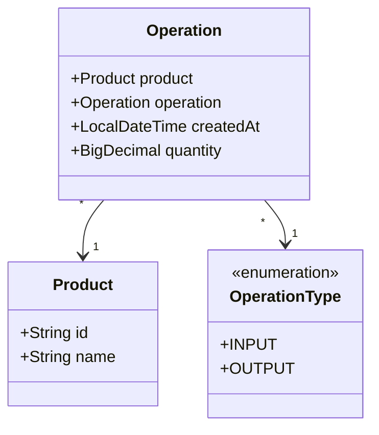

# Decola 2025
Projeto de API Restful de Operações de Movimento de Estoque

# Diagrama de classes

```mermaid
classDiagram
    class Operation {
        +Product product
        +Operation operation
        +LocalDateTime createdAt
        +BigDecimal quantity
    }

    class Product {
        +String id
        +String name
    }

    class OperationType {
        <<enumeration>>
        +INPUT
        +OUTPUT
    }

    Operation "*" --> "1" Product
    Operation "*" --> "1" OperationType
```
